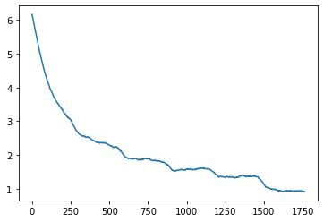
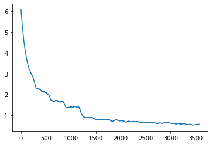
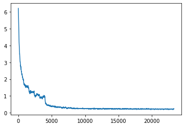
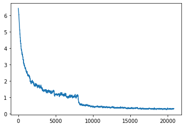

# 455-final-project: Bird Classification Challenge!
Contributor: Amber Xu,
             Jennifer Tao,
             Kenny Wu,
             Zuer Wang
[Video](https://washington.zoom.us/rec/share/pN7yxpXHHOu9ksLJie-GHSfrwJGL8dtzJffQagW5bnnOw-PLNv-AtDw6oUhnBv2K.EHd_Ev9Aw1O9Fd-N?startTime=1622870841000)         
             
## Overview
Since we are not good at distinguishing hundreds of different types of birds, we plan to train a computer vision model to help us recognize the birds. Hence we worked on the Kaggle Bird Classification Challenge. 

The purpose of this model is to classify images of birds based on the training set and their labels. There are 555 different image categories (birds) given by integers in the dataset, and we need to predict the labels of images in the training set. We used various ResNet pre-trained model architectures and experimented with augmenting training data to decrease overfitting. The challenge was to write a classifier, that given an unidentified picture of the bird never before seen it could predict the class of that bird with high accuracy. 
The goal of this problem was to reach ~80% accuracy or higher. To improve the accuracy of the identification, we trained three models using Resnet architecture (Resnet18, Resnet34, Resnet50).

## Problem setup & Data used
For this competition, the data that we used to train the models is provided by the instructor, Joseph Redmon.
A [starter code](https://colab.research.google.com/drive/1kHo8VT-onDxbtS3FM77VImG35h_K_Lav#scrollTo=yRzPDiVzsyGz) also provided by our instructor, including loading the data, training, making predictions, visualizing loss images.
We used GPU to run all our models.

## ResNet18 (Resolution=128)

We load a ResNet-18 model pre-trained on the image, train the model for five epochs on the training data, and generate predictions for the test images. We first tried to train with ResNet18 for 6 epochs. We decreased the learning rate from 0.01 to 0.001 when the epoch is 4.
```
resnet = torch.hub.load('pytorch/vision:v0.6.0', 'resnet18', pretrained=True)
resnet.fc = nn.Linear(512, 555) # This will reinitialize the layer as well
losses = train(resnet, data['train'], epochs=5, lr=.01, print_every=10, checkpoint_path=checkpoints)
```

Here is the graph of loss:
```
state = torch.load(checkpoints + 'checkpoint-6.pkl')
plt.plot(smooth(state['losses'], 50))
```


Our result after checkpoint 6 is:
  - test accuracy score on Kaggle: 0.64
  - train accuracy: 0.796458

## ResNet34 (Resolution=128)
Our second model is ResNet34. We trained for 12 epochs. Although we wrote 15 epochs, we did not finish running all of them since the accuracy did not change too much, and it was not high enough. We run this model without changing any other parmaeters. We decreased the learning rate from 0.01 to 0.001 midway through as above.
```
resnet = torch.hub.load('pytorch/vision:v0.6.0', 'resnet34', pretrained=True)
resnet.fc = nn.Linear(512, 555)
state = torch.load(checkpoints_resnet34 + 'checkpoint-3.pkl')
losses = train(resnet, data['train'], epochs=15, schedule={0:0.01, 4:0.001}, lr=.01, checkpoint_path=checkpoints_resnet34, state=state)
```

After finishing checkpoint12, we found that the loss did not change much and it floats in the range of (0.5, 0.7). It is impossible for the loss to continue decreasing. Thus, we stopped running the extra epochs.



Our result after checkpoint 12 is: 
  - test accuracy score on Kaggle: 0.669

## ResNet50 (Resolution=256)
Our third model is ResNet50. We trained for 30 epochs. Since increasing the size of the image inputs could improve the accuracy, we changed the transforms to use `Resize(256)` and `RandomCrop(256, padding=8, padding_mode='edge')` instead of `Resize(128)` and `RandomCrop(128, padding=8, padding_mode='edge')`. We also changed the test transforms to use `Resize(256)` instead of `Resize(128)`. However, it was not able to fit on our GPU memory, so we needed to decrease the batch size from 128 to 48. We also changed the learning rate from 0.01 initially, 0.001 after epoch 5, and 0.0001 after epoch 10.
```
resnet = torch.hub.load('pytorch/vision:v0.6.0', 'resnet50', pretrained=True)
resnet.fc = nn.Linear(2048, 555)
losses = train(resnet, data['train'], epochs=30, schedule={0:.01, 5:.001, 10:.0001}, lr=.01, checkpoint_path=checkpoints_resnet50)
```



Our result after checkpoint 30 is: 
  - test accuracy score on Kaggle: 0.816


## ResNet50 (Resolution=512)
Our fourth model is still ResNet50, but we change the resolution from 256 to 512. We trained with ResNet50 for 13 epochs since our memory space is not big enough to run more epochs. We also decreased the batch size from 48 to 24. The learning rate was from 0.01, to 0.001 after epoch 5, and finally 0.0001 after epoch 10.
```
resnet = torch.hub.load('pytorch/vision:v0.6.0', 'resnet50', pretrained=True)
resnet.fc = nn.Linear(2048, 555)
losses = train(resnet, data['train'], epochs=15, schedule={0:.01, 5:.001, 10:.0001}, lr=.01, checkpoint_path=checkpoints_resnet50)
```



Our result after checkpoint 13 is: 
  - test accuracy score on Kaggle: 0.851

## Discussion
Problem:

Initially, we used cpu to run our model, so it took us a few days to finish running ResNet18 and ResNet34. When we changed to use GPU, the project went much faster, but the memory space was too small to train with ResNet50. There are lots of warnings about full memory when we load the birds data and training. We had to decrease the batch size to run in colab. It might be better to run locally.

Improvements: 

From the data of kaggle leaderboard, the best accuracy is 0.937, which is pretty high. We all would like to learn about the approach they used. We would try to improve our models to get better if we have more time to work on it.
